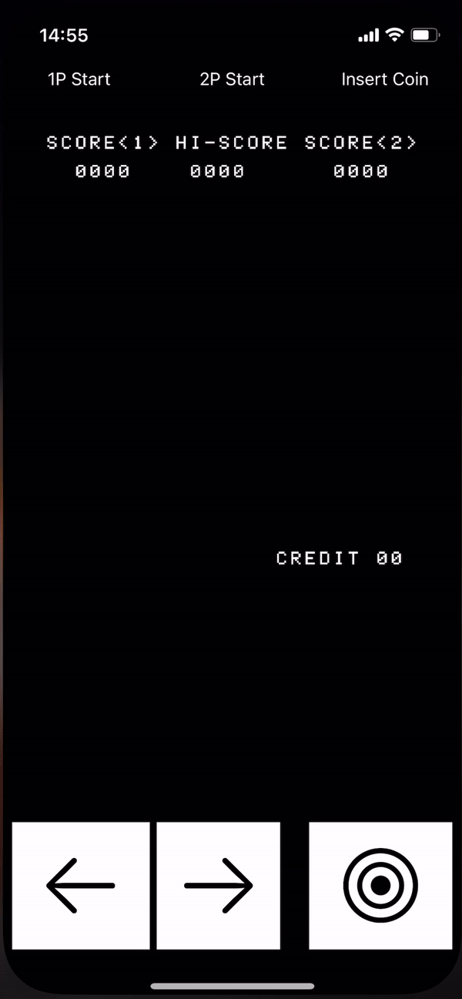

# SpaceInvaders

👾 Swift Emulation of Space Invaders built using [emul8080r](https://github.com/timsearle/emul8080r)



## What is it?
A little side project into understanding how to build an emulator in Swift - and where to start other than the arcade classic, Space Invaders.

## How do I play it?
Just clone down the project, and copy into the Supporting Files directory a MAME compatible original Space Invaders rom named `invaders.rom`. It's often available on the internet as:

```
invaders.h
invaders.g
invaders.f
invaders.e
```

So you can use the following terminal command to get the game into the appropriate format for this build:

```
cat invaders.h invaders.g invaders.f invaders.e > invaders.rom
```

### Thanks

* [emulator101.com](https://www.emulator101.com) - if it wasn't for this site, this almost certainly would've taken me far longer to produce.
* [classiccmp.org](http://www.classiccmp.org/dunfield/r/8080.txt) - a brilliant, high-level mapping of instruction values to descriptions
* [computerarcheology.com](http://computerarcheology.com/Arcade/SpaceInvaders/) - this site proved invaluable for debugging my implementation, understanding ROM and RAM ranges and just how Space Invaders originally operated on the 8080 and its associated hardware, helping me to build my own version [here](https://github.com/timsearle/SpaceInvaders).
* <a href="Files/8080asm.pdf"> Official Intel 8080 Assembly manual</a>
* Big thanks to [Nick Lockwood](https://github.com/nicklockwood) and his tutorial [Retro Rampage](https://github.com/nicklockwood/RetroRampage) - his code on rendering a bitmap to a UIImage was a massive time saver and only needed tiny tweaks to be fit for purpose here.

### Contributing

Happy to receive any and all contributions relating directly to making this a more enjoyable and playable version of the game! It very much is the bare minimum to allow playback of the game and does not support any sounds. Please do raise PRs including instruction implementations/bug fixes/enhancements. For anything relating to the emulator itself, head on over to the repository [here](https://github.com/timsearle/emul8080r).
